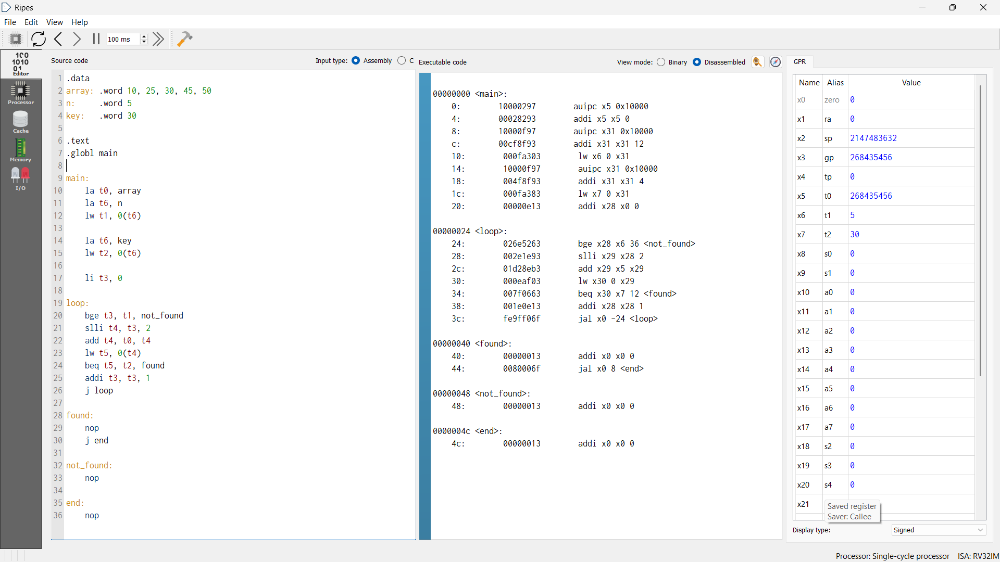
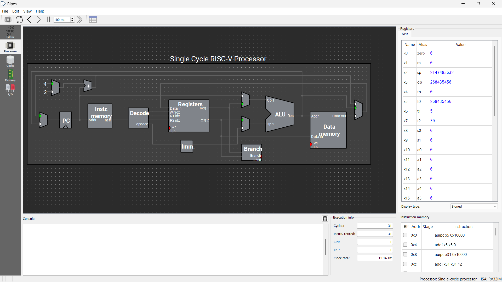
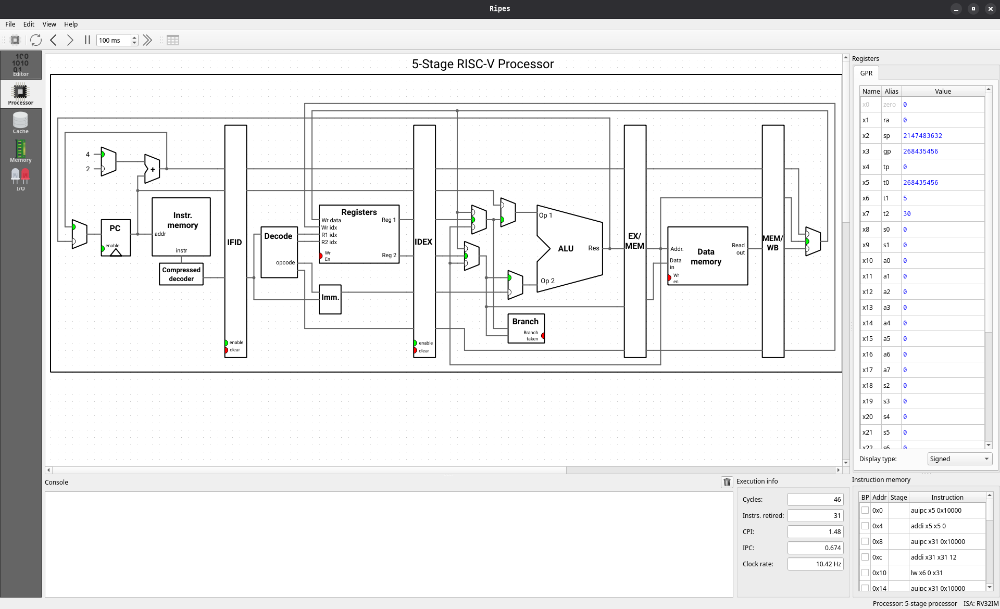

# PERFORMANCE ANALYSIS REPORT

## Linear Search using RISC-V (Ripes Simulator)

---

## Subject

**Computer Organization & Architecture**

## Course Code

**PBCST404**

## Group Number

**Group 5**

## Group Members

- Ahammed Halim (Roll No: 6)
- Anakha Shaju (Roll No: 60)
- Aravind Lal (Roll No: 13)
- Madhav S (Roll No: 32)

---

# 1. Experiment Title

Performance Analysis of **Linear Search Algorithm** implemented in **RISC-V Assembly Language** using the **Ripes Simulator**.

---

# 2. Objective

To analyze and compare the performance of a **Linear Search RISC-V Assembly program** on two processor architectures:

- **Single Cycle RISC-V Processor**
- **5-Stage Pipelined RISC-V Processor**

The comparison is done based on execution statistics such as:

- Clock Cycles
- Instructions Retired
- CPI (Cycles Per Instruction)
- IPC (Instructions Per Cycle)

---

# 3. Tools Used

- **Ripes Simulator**
- **RISC-V Assembly Language**
- **RV32IM ISA**

---

# 4. Program Description

The program performs a **Linear Search** on an integer array.

### Array

```
10, 25, 30, 45, 50
```

### Search Key

```
30
```

### Algorithm Steps

1. Load the base address of the array.
2. Load the array size.
3. Load the key value to be searched.
4. Iterate through each element of the array.
5. Compare each element with the key.
6. If found, branch to the **found** label.
7. Otherwise continue until the array ends.
8. If the key is not found, branch to **not_found**.

---

# 5. Experimental Setup

The same RISC-V assembly program was executed on two different processor models available in the Ripes simulator.

### Processor Configurations

| Processor | Architecture | ISA |
|-----------|-------------|-----|
| Single Cycle Processor | Non-pipelined | RV32IM |
| 5-Stage Processor | Pipelined | RV32IM |

---

# 6. Execution Results

## 6.1 Single Cycle RISC-V Processor

Execution statistics obtained from Ripes:

| Metric | Value |
|------|------|
| Cycles | **31** |
| Instructions Retired | **31** |
| CPI | **1.00** |
| IPC | **1.00** |

### Observations

- Each instruction completes in **one clock cycle**.
- Therefore **Cycles = Instructions Executed**.
- CPI is exactly **1** which is expected for a single-cycle architecture.

### Register Observation

The register values after execution show:

```
x30 (t5) = 30
```

This confirms that the search key **30** was successfully found during execution.

---

## 6.2 5-Stage RISC-V Processor

Execution statistics obtained from Ripes:

| Metric | Value |
|------|------|
| Cycles | **46** |
| Instructions Retired | **31** |
| CPI | **1.48** |
| IPC | **0.674** |

### Observations

- Total instructions executed are still **31**.
- However the processor required **46 clock cycles**.
- CPI increased due to **pipeline hazards and stalls**.

---

# 7. Performance Comparison

| Processor Type | Cycles | Instructions | CPI | IPC |
|----------------|-------|-------------|-----|-----|
| Single Cycle | 31 | 31 | 1.00 | 1.00 |
| 5-Stage Pipeline | 46 | 31 | 1.48 | 0.674 |

---

# 8. Analysis

### Single Cycle Processor

- Executes one instruction per cycle.
- No pipeline hazards occur.
- CPI remains constant at **1**.
- However the clock period of a single cycle processor is usually longer in real hardware.

### 5-Stage Pipelined Processor

The processor pipeline consists of the following stages:

1. IF – Instruction Fetch
2. ID – Instruction Decode
3. EX – Execute
4. MEM – Memory Access
5. WB – Write Back

Even though pipelining improves throughput in many cases, this program experiences:

- **Data hazards**
- **Branch hazards**
- **Pipeline stalls**

These hazards increase the total number of cycles required for execution.

Thus:

```
CPI = Cycles / Instructions
CPI = 46 / 31 ≈ 1.48
```

---

# 9. Conclusion

The experiment demonstrates the effect of processor architecture on program performance.

- The **Single Cycle Processor** executed the program in **31 cycles** with **CPI = 1**.
- The **5-Stage Pipelined Processor** required **46 cycles** due to pipeline hazards and stalls.
- Although pipelined processors are generally faster for large workloads, small programs with frequent branches and dependencies may experience pipeline overhead.

This experiment successfully illustrates the impact of pipeline architecture on instruction execution efficiency.

---

# 10. Screenshots Captured

The following screenshots were collected as part of the experiment.

---

### Assembly Code — Linear Search



---

### Single Cycle RISC-V Processor



.png>)

---

### 5-Stage Pipelined RISC-V Processor



.png>)

---

# 11. Result

The Linear Search RISC-V assembly program was successfully executed in the **Ripes Simulator**, and the performance differences between **single-cycle and pipelined processors** were analyzed.

---
